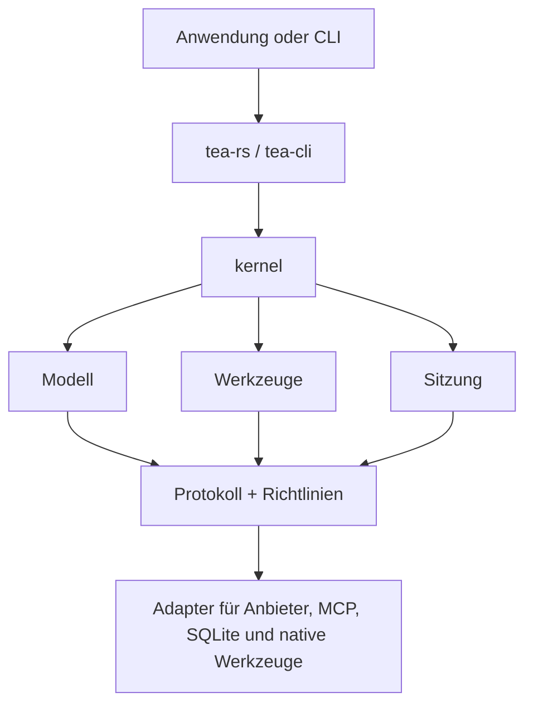

# Tea

[](https://github.com/tea-hq/tea-rs/actions/workflows/ci.yml)
[](https://crates.io/crates/tea-rs)
[](https://docs.rs/tea-rs)

Sprachen: [English](README.md) | [简体中文](README.zh-CN.md) | [繁體中文](README.zh-Hant.md) | [日本語](README.ja.md) | [한국어](README.ko.md) | [Español](README.es.md) | [Français](README.fr.md) | [Deutsch](README.de.md) | [Русский](README.ru.md)

Tea ist ein Rust-Toolkit zum Erstellen von KI-Agenten und Coding-Anwendungen,
die unabhängig vom Modellanbieter sind. Es bietet wiederverwendbare Runtime-Verträge,
Adapter für Modelle und Werkzeuge, Sitzungsspeicherung sowie einen Referenz-Client
für die Kommandozeile.

Das Projekt befindet sich in der frühen `0.1.x`-Versionsreihe. Öffentliche APIs
können sich vor einer stabilen Version ändern.

## Installation

Füge die Einbettungs-Facade zu einer Rust-Anwendung hinzu:

```bash
cargo add tea-rs
```

Der Kommandozeilen-Client kann separat installiert werden:

```bash
cargo install tea-cli
```

## Architektur

Anwendungen und CLI verwenden die Facade und die Runtime. Implementierungen für
Modelle, Werkzeuge, Richtlinien und Sitzungen werden über anbieterunabhängige
Kernverträge angeschlossen.



Der Workspace ist in kleine Crates aufgeteilt, sodass eine Anwendung nur die
benötigten Verträge und Adapter verwenden muss. Die wichtigsten Einstiegspunkte sind:

- `tea-rs`: Einbettungs-Facade und Runtime-Builder;
- `tea-kernel`: anbieterunabhängige Agentenschleife;
- `tea-protocol`, `tea-model`, `tea-tools`, `tea-policy` und `tea-session`: Kernverträge;
- `tea-provider-openai`, `tea-provider-anthropic`, `tea-mcp` und `tea-session-sqlite`: optionale Adapter;
- `tea-cli`: interaktive und kopflose CLI-Modi.

## Status und Inspiration

Tea befindet sich in einer aktiven `0.1.x`-Iteration. Die Architektur ist noch
nicht stabil, daher werden derzeit keine externen Pull Requests angenommen. Gute
Ideen und Vorschläge sind in den [GitHub Issues](https://github.com/tea-hq/tea-rs/issues) willkommen.

Tea ist eine unabhängige Rust-Implementierung, inspiriert vom Open-Source-Projekt
[Pi Agent](https://github.com/badlogic/pi-mono) und geprägt von den Designprinzipien
von [Codex TUI](https://github.com/openai/codex). Tea bietet keine Kompatibilität
auf Ebene von Quellcode, API oder Protokoll mit diesen Projekten.

## Dokumentation

Benutzerdokumentation und Integrationsanleitungen sind in der [Dokumentation](https://tea-hq.github.io/tea-docs/) verfügbar.

Die API-Dokumentation der Crates ist auf [docs.rs](https://docs.rs/tea-rs) verfügbar.

## Sicherheit

Eine Genehmigung ist ein Autorisierungsmechanismus und keine Sandbox des
Betriebssystems. Native Werkzeuge laufen normalerweise mit den Berechtigungen
des Hostprozesses. Lies [SECURITY.md](SECURITY.md), bevor du Anbieter, MCP-Server
oder Werkzeuge mit einem nicht vertrauenswürdigen Workspace verbindest.

Committe niemals API-Schlüssel, Tokens, Cookies, privaten Quellcode, echte
Nutzerdaten oder unbereinigte Provider-Payloads. Verwende Umgebungsvariablen und
synthetische Test-Fixtures.

## Entwicklung

```bash
cargo fmt --all --check
cargo test --workspace --all-features
cargo clippy --workspace --all-targets --all-features -- -D warnings
```

## Lizenz

Tea steht unter der [Apache License, Version 2.0](LICENSE).
