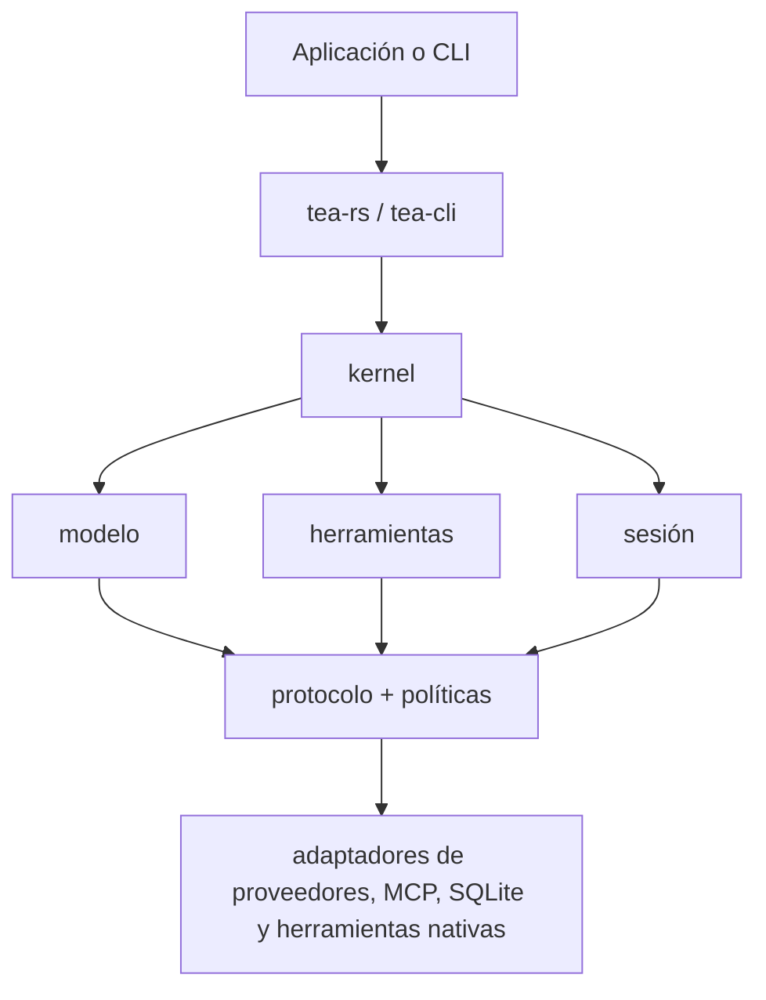

# Tea

[](https://github.com/tea-hq/tea-rs/actions/workflows/ci.yml)
[](https://crates.io/crates/tea-rs)
[](https://docs.rs/tea-rs)

Idiomas: [English](README.md) | [简体中文](README.zh-CN.md) | [繁體中文](README.zh-Hant.md) | [日本語](README.ja.md) | [한국어](README.ko.md) | [Español](README.es.md) | [Français](README.fr.md) | [Deutsch](README.de.md) | [Русский](README.ru.md)

Tea es un conjunto de herramientas en Rust para crear agentes de IA y aplicaciones de programación independientes del proveedor de modelos. Incluye contratos de runtime reutilizables, adaptadores de modelos y herramientas, almacenamiento de sesiones y un cliente de línea de comandos de referencia.

El proyecto se encuentra en la primera serie de versiones `0.1.x`. Las API públicas pueden cambiar antes de una versión estable.

## Instalación

Añade la facade de integración a una aplicación Rust:

```bash
cargo add tea-rs
```

El cliente de línea de comandos se puede instalar por separado:

```bash
cargo install tea-cli
```

## Arquitectura

Las aplicaciones y la CLI utilizan la facade y el runtime. Las implementaciones de modelos, herramientas, políticas y sesiones se conectan mediante contratos centrales independientes del proveedor.



El workspace está dividido en crates pequeños para que cada aplicación pueda elegir solo los contratos y adaptadores que necesita. Los puntos de entrada principales son:

- `tea-rs`: facade de integración y constructor del runtime;
- `tea-kernel`: bucle de agente independiente del proveedor;
- `tea-protocol`, `tea-model`, `tea-tools`, `tea-policy` y `tea-session`: contratos centrales;
- `tea-provider-openai`, `tea-provider-anthropic`, `tea-mcp` y `tea-session-sqlite`: adaptadores opcionales;
- `tea-cli`: modos de CLI interactivos y sin interfaz.

## Estado e inspiración

Tea se encuentra en una iteración activa de la serie `0.1.x`. Su arquitectura aún
no es estable, por lo que por ahora no se aceptan Pull Requests externos. Las buenas
ideas y sugerencias son bienvenidas en [GitHub Issues](https://github.com/tea-hq/tea-rs/issues).

Tea es una implementación independiente en Rust, inspirada en el proyecto de código
abierto [Pi Agent](https://github.com/badlogic/pi-mono) y guiada por la filosofía de
diseño de [Codex TUI](https://github.com/openai/codex). Tea no ofrece compatibilidad
de código fuente, API ni protocolo con ninguno de esos proyectos.

## Documentación

La documentación de usuario y las guías de integración están disponibles en la [Documentación](https://tea-hq.github.io/tea-docs/).

La documentación de la API de los crates está disponible en [docs.rs](https://docs.rs/tea-rs).

## Seguridad

La aprobación es un mecanismo de autorización, no un sandbox del sistema operativo. Las herramientas nativas se ejecutan normalmente con los permisos del proceso anfitrión. Lee [SECURITY.md](SECURITY.md) antes de conectar proveedores, servidores MCP o herramientas a un workspace que no sea de confianza.

No subas API keys, tokens, cookies, código fuente privado, datos reales de usuarios ni solicitudes o respuestas de proveedores sin anonimizar. Utiliza variables de entorno y fixtures de prueba sintéticos.

## Desarrollo

```bash
cargo fmt --all --check
cargo test --workspace --all-features
cargo clippy --workspace --all-targets --all-features -- -D warnings
```

## Licencia

Tea se distribuye bajo la [Apache License, Version 2.0](LICENSE).
