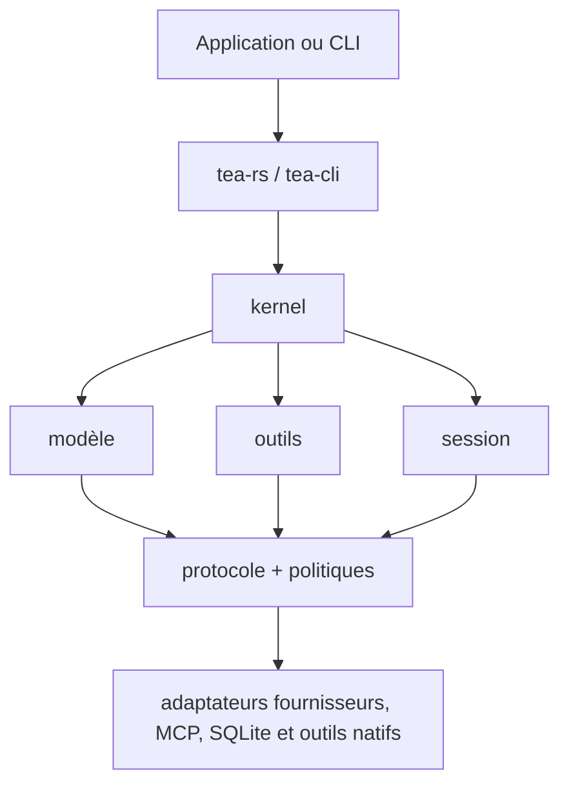

# Tea

[](https://github.com/tea-hq/tea-rs/actions/workflows/ci.yml)
[](https://crates.io/crates/tea-rs)
[](https://docs.rs/tea-rs)

Langues : [English](README.md) | [简体中文](README.zh-CN.md) | [繁體中文](README.zh-Hant.md) | [日本語](README.ja.md) | [한국어](README.ko.md) | [Español](README.es.md) | [Français](README.fr.md) | [Deutsch](README.de.md) | [Русский](README.ru.md)

Tea est une boîte à outils Rust pour créer des agents IA et des applications de
programmation indépendants des fournisseurs de modèles. Elle fournit des contrats
de runtime réutilisables, des adaptateurs de modèles et d'outils, un stockage de
sessions et un client de ligne de commande de référence.

Le projet se trouve dans la première série de versions `0.1.x`. Les API publiques
peuvent changer avant une version stable.

## Installation

Ajoutez la facade d'intégration à une application Rust :

```bash
cargo add tea-rs
```

Le client en ligne de commande peut être installé séparément :

```bash
cargo install tea-cli
```

## Architecture

Les applications et la CLI utilisent la facade et le runtime. Les implémentations
de modèles, d'outils, de politiques et de sessions se branchent sur des contrats
centraux indépendants des fournisseurs.



L'espace de travail est divisé en petits crates afin que chaque application ne
dépende que des contrats et adaptateurs dont elle a besoin. Les principaux points
d'entrée sont :

- `tea-rs` : facade d'intégration et constructeur du runtime ;
- `tea-kernel` : boucle d'agent indépendante du fournisseur ;
- `tea-protocol`, `tea-model`, `tea-tools`, `tea-policy` et `tea-session` : contrats centraux ;
- `tea-provider-openai`, `tea-provider-anthropic`, `tea-mcp` et `tea-session-sqlite` : adaptateurs optionnels ;
- `tea-cli` : modes de CLI interactif et sans interface.

## État et inspiration

Tea est dans une itération active de la série `0.1.x`. Son architecture n'est pas
encore stable ; les Pull Requests externes ne sont donc pas acceptées pour le moment.
Les bonnes idées et suggestions sont les bienvenues dans les [GitHub Issues](https://github.com/tea-hq/tea-rs/issues).

Tea est une implémentation Rust indépendante, inspirée par le projet open source
[Pi Agent](https://github.com/badlogic/pi-mono) et guidée par la philosophie de
conception de [Codex TUI](https://github.com/openai/codex). Tea n'offre aucune
compatibilité de code source, d'API ou de protocole avec ces projets.

## Documentation

La documentation utilisateur et les guides d'intégration sont disponibles dans la
[Documentation](https://tea-hq.github.io/tea-docs/).

La documentation des API des crates est disponible sur [docs.rs](https://docs.rs/tea-rs).

## Sécurité

L'approbation est un mécanisme d'autorisation, pas un sandbox du système
d'exploitation. Les outils natifs s'exécutent généralement avec les permissions
du processus hôte. Lisez [SECURITY.md](SECURITY.md) avant de connecter des
fournisseurs, des serveurs MCP ou des outils à un espace de travail non fiable.

Ne commitez jamais de clés API, jetons, cookies, code source privé, données réelles
d'utilisateurs ni de requêtes ou réponses de fournisseurs non expurgées. Utilisez
des variables d'environnement et des fixtures de test synthétiques.

## Développement

```bash
cargo fmt --all --check
cargo test --workspace --all-features
cargo clippy --workspace --all-targets --all-features -- -D warnings
```

## Licence

Tea est distribué sous [Apache License, Version 2.0](LICENSE).
