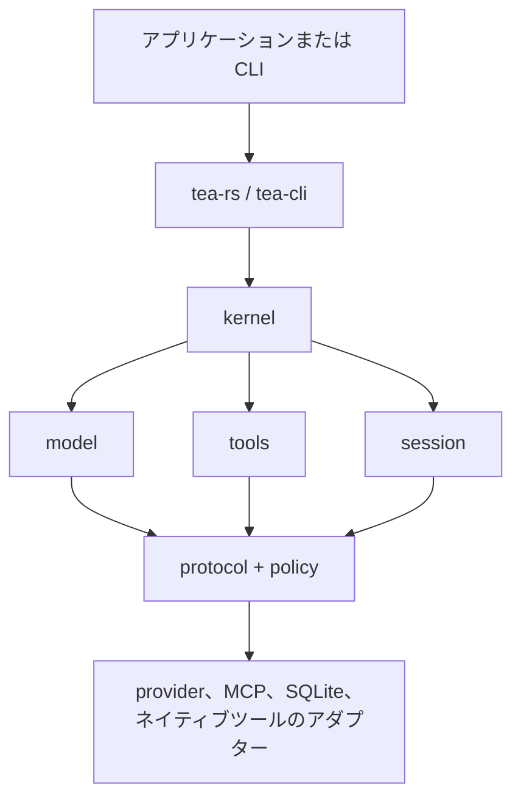

# Tea

[](https://github.com/tea-hq/tea-rs/actions/workflows/ci.yml)
[](https://crates.io/crates/tea-rs)
[](https://docs.rs/tea-rs)

言語: [English](README.md) | [简体中文](README.zh-CN.md) | [繁體中文](README.zh-Hant.md) | [日本語](README.ja.md) | [한국어](README.ko.md) | [Español](README.es.md) | [Français](README.fr.md) | [Deutsch](README.de.md) | [Русский](README.ru.md)

Tea は、特定のモデルプロバイダーに依存しない AI エージェントやコーディングアプリケーションを Rust で構築するためのツールキットです。再利用可能なランタイム契約、モデルとツールのアダプター、セッションストレージ、リファレンス CLI を提供します。

プロジェクトは現在、初期の `0.1.x` リリース系列です。安定版リリースまでは公開 API が変更される可能性があります。

## インストール

Rust アプリケーションに埋め込み用 facade を追加します。

```bash
cargo add tea-rs
```

CLI は個別にインストールできます。

```bash
cargo install tea-cli
```

## アーキテクチャ

アプリケーションと CLI は facade とランタイムを利用します。モデル、ツール、ポリシー、セッションの実装は、プロバイダーに依存しないコア契約に接続します。



ワークスペースは小さな crate に分割されているため、必要な契約とアダプターだけを選択できます。主なエントリーポイントは次のとおりです。

- `tea-rs`: 埋め込み用 facade とランタイムビルダー;
- `tea-kernel`: プロバイダーに依存しないエージェントループ;
- `tea-protocol`、`tea-model`、`tea-tools`、`tea-policy`、`tea-session`: コア契約;
- `tea-provider-openai`、`tea-provider-anthropic`、`tea-mcp`、`tea-session-sqlite`: オプションアダプター;
- `tea-cli`: 対話型およびヘッドレスの CLI モード。

## プロジェクトの状態と着想

Tea は現在、活発な `0.1.x` の開発段階にあります。アーキテクチャはまだ安定
していないため、現時点では外部からの Pull Request を受け付けていません。
よいアイデアや提案は [GitHub Issues](https://github.com/tea-hq/tea-rs/issues)
でお知らせください。

Tea は独立した Rust 実装です。オープンソースの [Pi Agent](https://github.com/badlogic/pi-mono)
プロジェクトに着想を得て、[Codex TUI](https://github.com/openai/codex) の設計思想を
参考にしています。Tea はこれらのプロジェクトとのソースコード、API、プロトコル互換性を
提供しません。

## ドキュメント

ユーザードキュメントと統合ガイドは [ドキュメント](https://tea-hq.github.io/tea-docs/) で確認できます。

crate API ドキュメントは [docs.rs](https://docs.rs/tea-rs) で確認できます。

## セキュリティ

承認は認可の仕組みであり、OS のサンドボックスではありません。ネイティブツールは通常、ホストプロセスの権限で実行されます。プロバイダー、MCP サーバー、ツールを信頼できないワークスペースに接続する前に [SECURITY.md](SECURITY.md) を読んでください。

API key、トークン、Cookie、非公開ソースコード、実際のユーザーデータ、未編集のプロバイダーリクエストやレスポンスをコミットしないでください。環境変数と合成テストフィクスチャを使用してください。

## 開発

```bash
cargo fmt --all --check
cargo test --workspace --all-features
cargo clippy --workspace --all-targets --all-features -- -D warnings
```

## ライセンス

Tea は [Apache License, Version 2.0](LICENSE) の下で提供されています。
