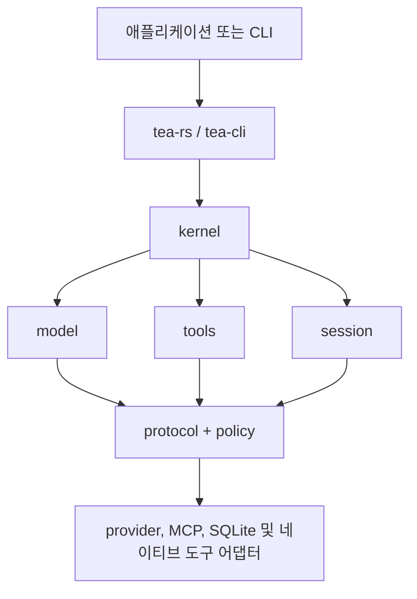

# Tea

[](https://github.com/tea-hq/tea-rs/actions/workflows/ci.yml)
[](https://crates.io/crates/tea-rs)
[](https://docs.rs/tea-rs)

언어: [English](README.md) | [简体中文](README.zh-CN.md) | [繁體中文](README.zh-Hant.md) | [日本語](README.ja.md) | [한국어](README.ko.md) | [Español](README.es.md) | [Français](README.fr.md) | [Deutsch](README.de.md) | [Русский](README.ru.md)

Tea는 특정 모델 제공자에 종속되지 않는 AI 에이전트와 코딩 애플리케이션을 Rust로 구축하기 위한 도구 모음입니다. 재사용 가능한 런타임 계약, 모델 및 도구 어댑터, 세션 저장소와 참조용 CLI를 제공합니다.

프로젝트는 현재 초기 `0.1.x` 릴리스 단계입니다. 안정 버전이 출시되기 전까지 공개 API가 변경될 수 있습니다.

## 설치

Rust 애플리케이션에 임베딩 facade를 추가합니다.

```bash
cargo add tea-rs
```

CLI는 별도로 설치할 수 있습니다.

```bash
cargo install tea-cli
```

## 아키텍처

애플리케이션과 CLI는 facade와 런타임을 사용합니다. 모델, 도구, 정책 및 세션 구현은 제공자에 종속되지 않는 핵심 계약에 연결됩니다.



워크스페이스는 작은 crate로 나뉘어 있어 필요한 계약과 어댑터만 선택할 수 있습니다. 주요 진입점은 다음과 같습니다.

- `tea-rs`: 임베딩 facade와 런타임 빌더;
- `tea-kernel`: 제공자 중립 에이전트 루프;
- `tea-protocol`, `tea-model`, `tea-tools`, `tea-policy`, `tea-session`: 핵심 계약;
- `tea-provider-openai`, `tea-provider-anthropic`, `tea-mcp`, `tea-session-sqlite`: 선택적 어댑터;
- `tea-cli`: 대화형 및 헤드리스 CLI 모드.

## 프로젝트 상태와 영감

Tea는 현재 활발한 `0.1.x` 반복 개발 단계에 있습니다. 아키텍처가 아직 안정되지
않았으므로 현재는 외부 Pull Request를 받지 않습니다. 좋은 아이디어와 제안은
[GitHub Issues](https://github.com/tea-hq/tea-rs/issues)에 남겨 주세요.

Tea는 독립적인 Rust 구현입니다. 오픈 소스 [Pi Agent](https://github.com/badlogic/pi-mono)
프로젝트에서 영감을 받았고 [Codex TUI](https://github.com/openai/codex)의 설계 철학을
참고했습니다. Tea는 이 프로젝트들과 소스 코드, API 또는 프로토콜 호환성을 제공하지 않습니다.

## 문서

사용자 문서와 통합 가이드는 [Tea documentation repository](https://github.com/tea-hq/tea-docs)에서 관리합니다.

crate API 문서는 [docs.rs](https://docs.rs/tea-rs)에서 확인할 수 있습니다.

## 보안

승인은 권한 부여 수단이며 운영체제 샌드박스가 아닙니다. 네이티브 도구는 일반적으로 호스트 프로세스의 권한으로 실행됩니다. 제공자, MCP 서버 또는 도구를 신뢰할 수 없는 워크스페이스에 연결하기 전에 [SECURITY.md](SECURITY.md)를 읽으세요.

API key, 토큰, Cookie, 비공개 소스 코드, 실제 사용자 데이터 또는 편집되지 않은 제공자 요청과 응답을 커밋하지 마세요. 환경 변수와 합성 테스트 픽스처를 사용하세요.

## 개발

```bash
cargo fmt --all --check
cargo test --workspace --all-features
cargo clippy --workspace --all-targets --all-features -- -D warnings
```

## 라이선스

Tea는 [Apache License, Version 2.0](LICENSE)에 따라 제공됩니다.
