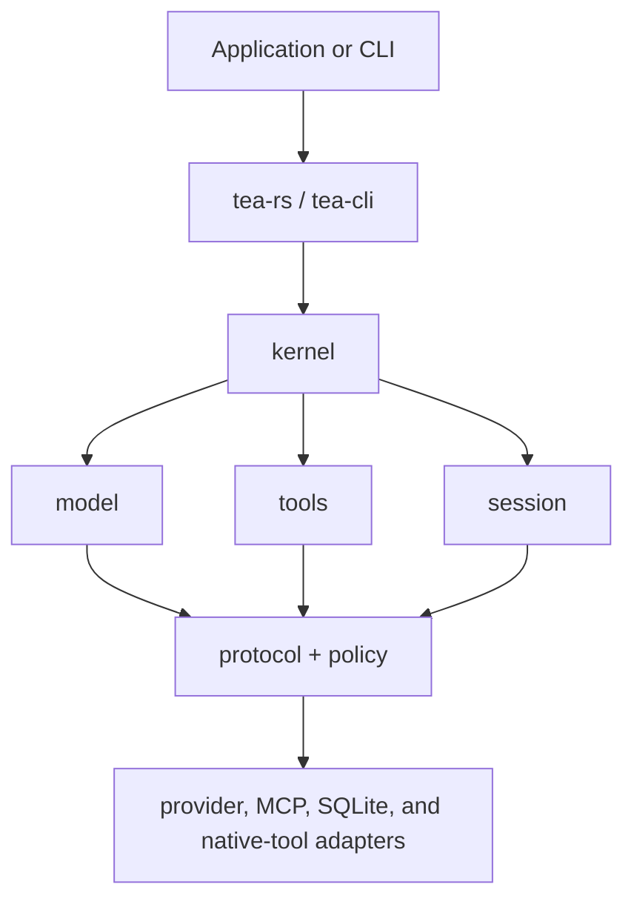

# Tea

[](https://github.com/tea-hq/tea-rs/actions/workflows/ci.yml)
[](https://crates.io/crates/tea-rs)
[](https://docs.rs/tea-rs)

Languages: [English](README.md) | [简体中文](README.zh-CN.md) | [繁體中文](README.zh-Hant.md) | [日本語](README.ja.md) | [한국어](README.ko.md) | [Español](README.es.md) | [Français](README.fr.md) | [Deutsch](README.de.md) | [Русский](README.ru.md)

Tea is a Rust toolkit for building provider-neutral AI agents and coding
applications. It includes reusable runtime contracts, model and tool adapters,
session storage, and a reference command-line client.

The project is in the early `0.1.x` release line. Public APIs may change
before a stable release.

## Install

Add the embedding facade to a Rust application:

```bash
cargo add tea-rs
```

The command-line client can be installed separately:

```bash
cargo install tea-cli
```

## Architecture

Applications and the CLI use the facade and runtime. Provider, tool, policy,
and session implementations plug into provider-neutral core contracts.



The workspace is split into small crates so an application can depend only on
the contracts and adapters it needs. The main entry points are:

- `tea-rs`: embedding facade and runtime builder;
- `tea-kernel`: provider-neutral agent loop;
- `tea-protocol`, `tea-model`, `tea-tools`, `tea-policy`, and `tea-session`:
  core contracts;
- `tea-provider-openai`, `tea-provider-anthropic`, `tea-mcp`, and
  `tea-session-sqlite`: optional adapters;
- `tea-cli`: interactive and headless command-line modes.

## Status and inspiration

Tea is in an active `0.1.x` iteration. Its architecture is not yet stable, so
external pull requests are not accepted for now. Ideas and suggestions are
welcome in [GitHub Issues](https://github.com/tea-hq/tea-rs/issues).

Tea is an independent Rust implementation inspired by the open-source
[Pi Agent](https://github.com/badlogic/pi-mono) project and informed by the
design philosophy of [Codex TUI](https://github.com/openai/codex). Tea does
not provide source-code, API, or protocol compatibility with either project.

## Documentation

User documentation and integration guides are available on the [Tea
documentation site](https://tea-hq.github.io/tea-docs/). The source is
maintained in the [Tea documentation repository](https://github.com/tea-hq/tea-docs).

Crate API documentation is available on [docs.rs](https://docs.rs/tea-rs).

## Security

Approval is an authorization mechanism, not an operating-system sandbox.
Native tools run with the permissions of the host process. Read
[SECURITY.md](SECURITY.md) before connecting providers, MCP servers, or tools
to an untrusted workspace.

Never commit API keys, tokens, cookies, private source, real user data, or
unredacted provider payloads. Use environment variables and synthetic test
fixtures.

## Development

```bash
cargo fmt --all --check
cargo test --workspace --all-features
cargo clippy --workspace --all-targets --all-features -- -D warnings
```

## License

Tea is licensed under the [Apache License, Version 2.0](LICENSE).
