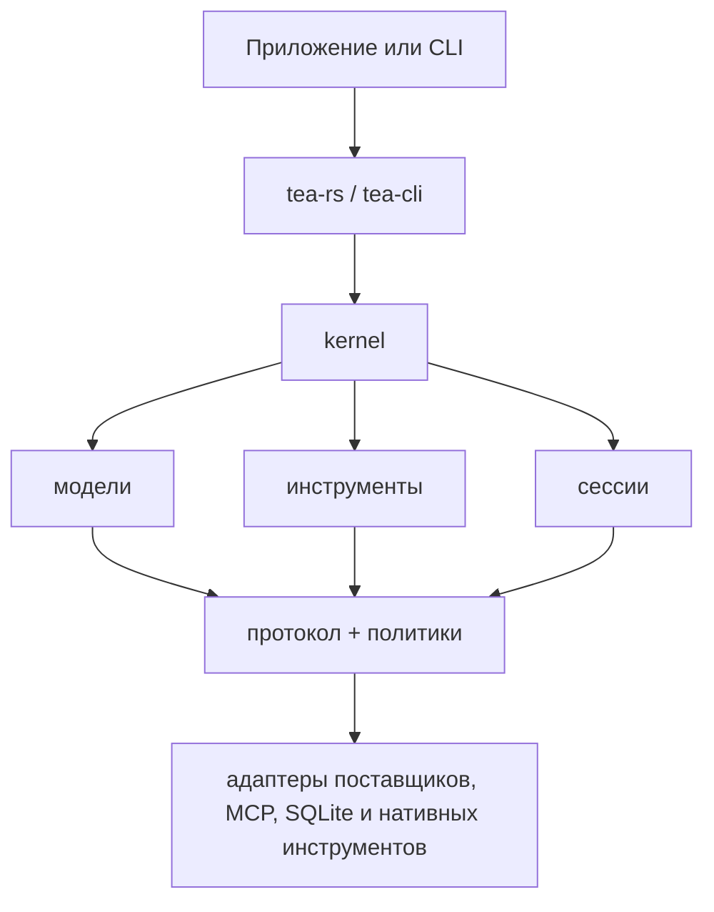

# Tea

[](https://github.com/tea-hq/tea-rs/actions/workflows/ci.yml)
[](https://crates.io/crates/tea-rs)
[](https://docs.rs/tea-rs)

Языки: [English](README.md) | [简体中文](README.zh-CN.md) | [繁體中文](README.zh-Hant.md) | [日本語](README.ja.md) | [한국어](README.ko.md) | [Español](README.es.md) | [Français](README.fr.md) | [Deutsch](README.de.md) | [Русский](README.ru.md)

Tea — это набор инструментов на Rust для создания AI-агентов и приложений для
разработки, не зависящих от конкретного поставщика моделей. Он включает повторно
используемые контракты среды выполнения, адаптеры моделей и инструментов, хранилище
сессий и эталонный клиент командной строки.

Проект находится на ранней стадии выпуска `0.1.x`. До выхода стабильной версии
публичные API могут изменяться.

## Установка

Добавьте фасад для встраивания в приложение на Rust:

```bash
cargo add tea-rs
```

Клиент командной строки можно установить отдельно:

```bash
cargo install tea-cli
```

## Архитектура

Приложения и CLI используют фасад и среду выполнения. Реализации моделей,
инструментов, политик и сессий подключаются через независимые от поставщика
моделей основные контракты.



Рабочая область разделена на небольшие crates, поэтому приложение может выбрать
только нужные ему контракты и адаптеры. Основные точки входа:

- `tea-rs`: фасад для встраивания и конструктор среды выполнения;
- `tea-kernel`: цикл агента, независимый от поставщика моделей;
- `tea-protocol`, `tea-model`, `tea-tools`, `tea-policy` и `tea-session`: основные контракты;
- `tea-provider-openai`, `tea-provider-anthropic`, `tea-mcp` и `tea-session-sqlite`: дополнительные адаптеры;
- `tea-cli`: интерактивный и безинтерфейсный режимы CLI.

## Статус и источники вдохновения

Tea находится в активной итерации `0.1.x`. Архитектура проекта ещё нестабильна,
поэтому внешние Pull Request пока не принимаются. Хорошие идеи и предложения
можно оставить в [GitHub Issues](https://github.com/tea-hq/tea-rs/issues).

Tea — независимая реализация на Rust, вдохновлённая открытым проектом
[Pi Agent](https://github.com/badlogic/pi-mono) и использующая идеи дизайна
[Codex TUI](https://github.com/openai/codex). Tea не предоставляет совместимость
с этими проектами на уровне исходного кода, API или протокола.

## Документация

Пользовательская документация и руководства по интеграции поддерживаются в
[репозитории документации Tea](https://github.com/tea-hq/tea-docs).

Документация API crates доступна на [docs.rs](https://docs.rs/tea-rs).

## Безопасность

Подтверждение — это механизм авторизации, а не песочница операционной системы.
Нативные инструменты обычно выполняются с правами процесса-хоста. Прочитайте
[SECURITY.md](SECURITY.md), прежде чем подключать поставщиков, MCP-серверы или
инструменты к ненадёжной рабочей области.

Не добавляйте в коммиты ключи API, токены, cookie, закрытый исходный код,
реальные пользовательские данные или необезличенные запросы и ответы поставщиков.
Используйте переменные окружения и синтетические тестовые фикстуры.

## Разработка

```bash
cargo fmt --all --check
cargo test --workspace --all-features
cargo clippy --workspace --all-targets --all-features -- -D warnings
```

## Лицензия

Tea распространяется по лицензии [Apache License, Version 2.0](LICENSE).
