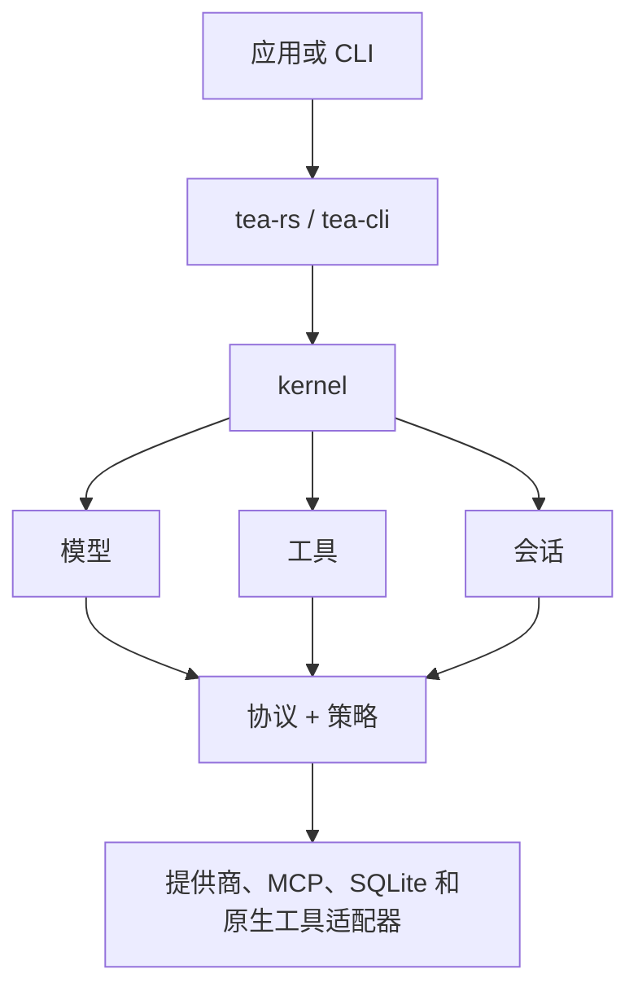

# Tea

[](https://github.com/tea-hq/tea-rs/actions/workflows/ci.yml)
[](https://crates.io/crates/tea-rs)
[](https://docs.rs/tea-rs)

语言： [English](README.md) | [简体中文](README.zh-CN.md) | [繁體中文](README.zh-Hant.md) | [日本語](README.ja.md) | [한국어](README.ko.md) | [Español](README.es.md) | [Français](README.fr.md) | [Deutsch](README.de.md) | [Русский](README.ru.md)

Tea 是一个使用 Rust 构建、用于开发与具体模型提供商无关的 AI Agent 和编码应用的工具集。它包含可复用的运行时契约、模型与工具适配器、会话存储，以及一个参考命令行客户端。

项目目前处于早期 `0.1.x` 发布阶段。在稳定版本发布前，公开 API 可能会发生变化。

## 安装

将嵌入式 facade 添加到 Rust 应用：

```bash
cargo add tea-rs
```

命令行客户端可以单独安装：

```bash
cargo install tea-cli
```

## 架构

应用和 CLI 使用 facade 与运行时。模型、工具、策略和会话实现通过与提供商无关的核心契约接入。



工作区被拆分为多个小型 crate，因此应用可以只依赖需要的契约和适配器。主要入口包括：

- `tea-rs`：嵌入式 facade 和运行时构建器；
- `tea-kernel`：与提供商无关的 Agent 循环；
- `tea-protocol`、`tea-model`、`tea-tools`、`tea-policy` 和 `tea-session`：核心契约；
- `tea-provider-openai`、`tea-provider-anthropic`、`tea-mcp` 和 `tea-session-sqlite`：可选适配器；
- `tea-cli`：交互式和无界面命令行模式。

## 项目状态与灵感来源

Tea 当前处于活跃的 `0.1.x` 迭代阶段，架构尚未稳定，因此暂不接受外部
Pull Request。欢迎通过 [GitHub Issues](https://github.com/tea-hq/tea-rs/issues)
反馈好的想法和建议。

Tea 是独立实现的 Rust 项目，受到开源 [Pi Agent](https://github.com/badlogic/pi-mono)
项目的启发，并借鉴了 [Codex TUI](https://github.com/openai/codex) 的设计理念。
Tea 不提供与上述项目的源代码、API 或协议兼容性。

## 文档

用户文档和集成指南可在 [Tea 文档网站](https://tea-hq.github.io/tea-docs/) 查看，文档源文件维护在 [Tea 文档仓库](https://github.com/tea-hq/tea-docs)。

crate API 文档可在 [docs.rs](https://docs.rs/tea-rs) 查看。

## 安全

审批是授权机制，不是操作系统沙箱。原生工具通常以宿主进程的权限运行。在将提供商、MCP 服务器或工具连接到不受信任的工作区前，请阅读 [SECURITY.md](SECURITY.md)。

不要提交 API key、令牌、Cookie、私有源代码、真实用户数据或未脱敏的提供商请求与响应。请使用环境变量和合成测试夹具。

## 开发

```bash
cargo fmt --all --check
cargo test --workspace --all-features
cargo clippy --workspace --all-targets --all-features -- -D warnings
```

## 许可证

Tea 使用 [Apache License, Version 2.0](LICENSE) 授权。
