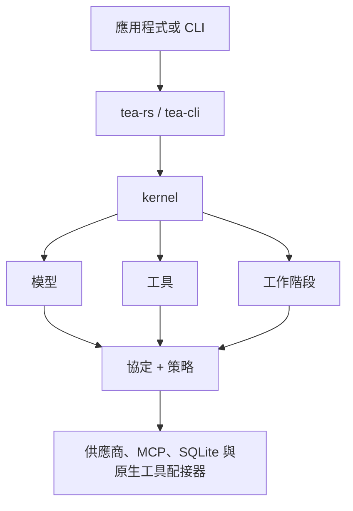

# Tea

[](https://github.com/tea-hq/tea-rs/actions/workflows/ci.yml)
[](https://crates.io/crates/tea-rs)
[](https://docs.rs/tea-rs)

語言： [English](README.md) | [简体中文](README.zh-CN.md) | [繁體中文](README.zh-Hant.md) | [日本語](README.ja.md) | [한국어](README.ko.md) | [Español](README.es.md) | [Français](README.fr.md) | [Deutsch](README.de.md) | [Русский](README.ru.md)

Tea 是一套以 Rust 建構、用於開發與模型供應商無關的 AI Agent 與編碼應用程式的工具組。它包含可重複使用的執行階段契約、模型與工具配接器、工作階段儲存，以及參考用命令列用戶端。

本專案目前處於早期 `0.1.x` 發行階段。在穩定版本推出前，公開 API 可能會變更。

## 安裝

將嵌入式 facade 加入 Rust 應用程式：

```bash
cargo add tea-rs
```

命令列用戶端可以獨立安裝：

```bash
cargo install tea-cli
```

## 架構

應用程式與 CLI 使用 facade 和執行階段。模型、工具、策略與工作階段實作，透過與供應商無關的核心契約接入。



工作區拆分為多個小型 crate，因此應用程式可以只依賴需要的契約與配接器。主要入口包括：

- `tea-rs`：嵌入式 facade 與執行階段建構器；
- `tea-kernel`：與供應商無關的 Agent 循環；
- `tea-protocol`、`tea-model`、`tea-tools`、`tea-policy` 與 `tea-session`：核心契約；
- `tea-provider-openai`、`tea-provider-anthropic`、`tea-mcp` 與 `tea-session-sqlite`：選用配接器；
- `tea-cli`：互動式與無介面命令列模式。

## 專案狀態與靈感來源

Tea 目前處於活躍的 `0.1.x` 迭代階段，架構尚未穩定，因此暫不接受外部
Pull Request。歡迎透過 [GitHub Issues](https://github.com/tea-hq/tea-rs/issues)
回饋好的想法與建議。

Tea 是獨立實作的 Rust 專案，受到開源 [Pi Agent](https://github.com/badlogic/pi-mono)
專案的啟發，並借鑑 [Codex TUI](https://github.com/openai/codex) 的設計理念。
Tea 不提供與上述專案的原始碼、API 或協定相容性。

## 文件

使用者文件與整合指南維護於 [Tea 文件儲存庫](https://github.com/tea-hq/tea-docs)。

crate API 文件可在 [docs.rs](https://docs.rs/tea-rs) 查看。

## 安全性

核准是授權機制，不是作業系統沙箱。原生工具通常以主機程序的權限執行。將供應商、MCP 伺服器或工具連接到不受信任的工作區前，請閱讀 [SECURITY.md](SECURITY.md)。

請勿提交 API key、權杖、Cookie、私有原始碼、真實使用者資料或未去識別化的供應商請求與回應。請使用環境變數與合成測試夾具。

## 開發

```bash
cargo fmt --all --check
cargo test --workspace --all-features
cargo clippy --workspace --all-targets --all-features -- -D warnings
```

## 授權條款

Tea 採用 [Apache License, Version 2.0](LICENSE) 授權。
